<!-- AWAKEN:START -->
<!-- Generated by git-profile-awaken. Edit awaken.json instead of this block. -->







<a href="https://github.com/phamthang44/Ecommerce-Coursework"></a>
<a href="https://github.com/phamthang44/internal-room-booking-system"></a>





<!-- AWAKEN:END -->
